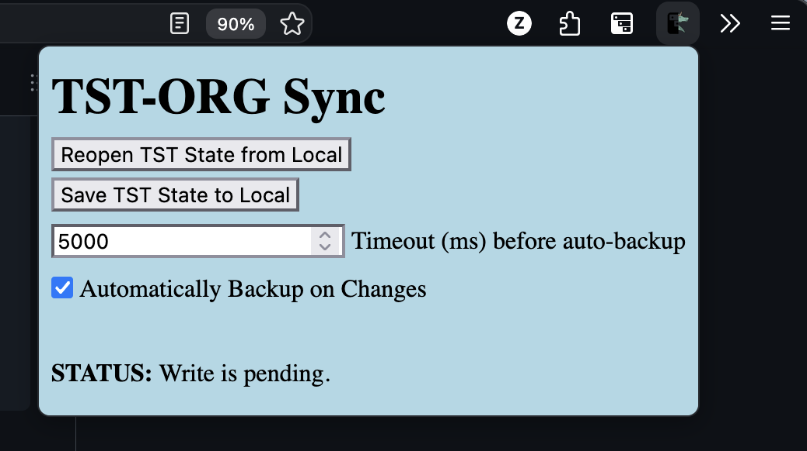

automatically backup [[https://addons.mozilla.org/en-GB/firefox/addon/tree-style-tab/][Tree Style Tab's]] heirarchical tab state to human-readable (and editable) org-mode, and on-request update the current TST State to be that of the local file.

- [[#context][Context]]
- [[#installation][Installation]]
- [[#org-mode-file-format][Org File Format]]
- [[#popup-styling][Popup Styling]]
- [[#ui-preview][UI Preview]]

** Context 
Intended to enable the workflow of managing one's tab-pile from a more easily-parseable, bulk-editable org file, using their preferred editing setup within emacs.

to best try to prevent any syncing mishaps that could result in any tab-losses, the extension will only write to the local file if:
- auto-backups are manually toggled on from within the extension's popup (resets to being off on extension startup)
- the file's modification time matches the extension's saved modification time for the file (on installation, manually save to local)

    using this extension in the way described does mean that there is a local web server exposing a .org file containing your browser tabs. there are surely innumerable other security issues but i imagine none of them are major.

    note that the extension does not support reopening priveleged tabs, due to limits of the webextension api.

More than happy to accept any improvements another person may offer; Im sure I have violated many best-practices unintentionally and am willing to learn.
This was written by an (albeit inept) human; No generative AI has or ever will come close to anything I work on.

happy tab hoarding :)

** Installation
This extension only supports firefox , with some reasonably recent version likely being required.

To install the extension, open =about:debugging= and load =tst-org-backup.zip= from this repo under Temporary Extensions.

Other than the extension itself, you need to run a http-server from within emacs so that the extension can access and modify a local file (the extension sends a request for emacs to do so, when needed). An example (but probably inefficient) way of doing so is shown below.

#+begin_src elisp
(setq my/local-file-path "path/to/file.org")

(use-package simple-httpd
  :config
  (httpd-start)
  (setq httpd-port 8080))

(httpd-servlet tst-org-backup/read-file text/plain ()
  (insert-file-contents my/local-file-path))

(httpd-servlet tst-org-backup/read-timestamp text/plain ()
  (let* ((modification-time (file-attribute-modification-time (file-attributes my/local-file-path)))
         (modification-string (substring (format "%s" modification-time) 1 -1)))
    (insert modification-string)))

(defun httpd/tst-org-backup/write (proc path &rest args)
  "PROC PATH ARGS."
  (let* ((body (cdr (car (last (cdr (car (last args))))))) ;; this is really ugly but works?
         (body-string (substring (format "%s" body) 1 -1)))
    (with-temp-file my/local-file-path
      (insert body-string))
    (with-httpd-buffer proc
      (insert "File Write Success"))))

#+end_src

the extension expects the following endpoints:
- [[http://localhost/8080/tst-org-backup/read-file]] (should return the raw org file as a response)
- [[http://localhost/8080/tst-org-backup/read-timestamp]] (should return the modification time of the file in the same format as defined in =C-h f current-time=)
- [[http://localhost/8080/tst-org-backup/write]] (up to you)

** Org-mode file format
stored in the format of:

#+begin_src text
* PINNED [[https://pinned-tab.co.uk][Pinned Tab]]
* my-folder-name
** [[https://a-link.com][A Link Title]]
** [[https://another-link.com][Another Title]]
*** [[https://child-link.com][cool cats]]
* [[https://epic-link.com][A different link]]
** [[https://more-websites.com][secret niche fragrance]]
some plain text notes that are ignored
** a-nested-folder
*** [[https://the-website.site][even nicher fragrance]]
*** [[https://the-website.site/url][even nicher fragrance root(a)]]
#+end_src

wherein plaintext org headings are converted to tst folders: =ext+treestyletab:group?title=my-folder-name=

and any pinned tabs are prefixed with "PINNED"

any plain text under a heading is ignored, but the parsing is not very robust so please care with passing malformed org to the extension.

there is a decent chance that any tab title that contains square brackets or other similar chicanery will break the parsing... realistically if this happens you will notice it whne trying to import and can go into the org file and spot the issue (as it would also break org mode rendering).

** Popup Styling
I left the styling of the extension intentionally sparse as my personal setup is very stylistcally opinionated. You could modify the extensions style in your `userContent.css`, using the web inspector to see classnames to target that which you wish to style.

_userContent.css_
#+begin_src css
@document url-prefix("moz-extension://the-extension-uuid/") {
    body {
        your-style: here;
    }
}
#+end_src

*** ui preview

